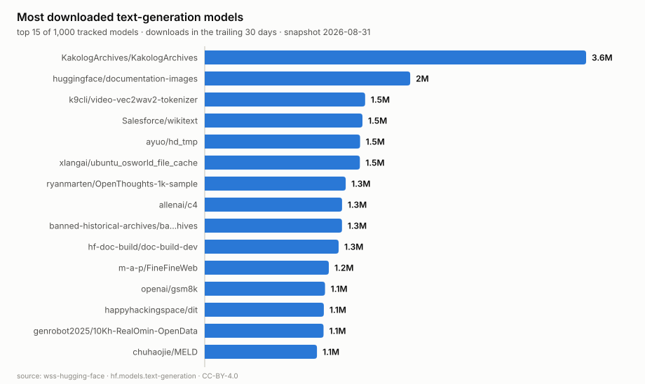
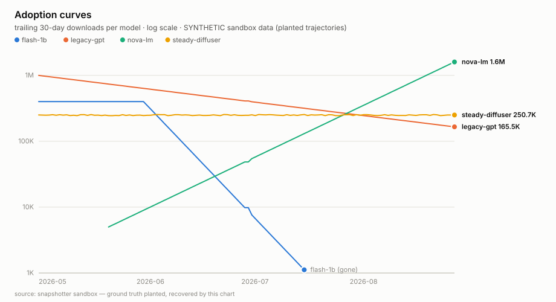

# wss-hugging-face — Hugging Face Adoption History

Point-in-time capture of Hugging Face Hub model adoption metrics, from a
start date until "so far", appended daily into CSVs by a registry-driven
capture fleet.

## Why this exists

The public Hugging Face API exposes only `downloads` (**rolling last 30
days**) and `downloadsAllTime` (**running total**) — no historical breakdown;
month-by-month history is enterprise-only and limited to an org's own assets.
So **no public adoption history exists for the open-model ecosystem, and
every uncaptured day is permanently gone.** This repo captures those values
every day, archives the raw responses verbatim, and rebuilds clean
observation tables from the archive.

## What you get

- `derived/observations/<YYYY-MM>.csv` — long-format, append-only:
  `series_id, entity_id, observed_at, captured_at, metric, value, unit,
  source_id, raw_ref, parser_version`. Metrics: `downloads_30d`,
  `downloads_all_time`, `likes`. Every row cites the raw file it was parsed
  from — provenance from chart back to bytes.
- `raw/` — the archived API responses, verbatim, forever.
- `manifest/` — the append-only fetch log ("we looked and it was identical"
  rows included); its commit history is the provenance record.
- `health/health.csv` — fleet health, worst first, rebuilt daily.

Start here: [docs/how-it-works.md](docs/how-it-works.md) ·
[docs/data-layout.md](docs/data-layout.md) ·
[examples/queries.sql](examples/queries.sql) ·
[examples/load_observations.py](examples/load_observations.py) ·
[examples/visualize.py](examples/visualize.py)

## The data, at a glance

Rendered from the latest real capture by
[examples/visualize.py](examples/visualize.py) — stdlib-only, deterministic
SVG; re-run it any time to refresh the charts from `derived/`.

This is what the dataset becomes with months of daily captures: overtakes,
decay, and deaths, all reconstructable to the raw bytes. Today's render uses
the engine sandbox's **synthetic** archive (clearly captioned — the analysis
was proven against planted ground truth before real data existed); once ≥ 8
real capture dates accumulate, `visualize.py` switches to real history
automatically.

## How it is built

The engine is [snapshotter](https://github.com/OWNER/snapshotter) (pinned in
[requirements.txt](requirements.txt)); this repo holds **no engine code** —
only a registry, two parsers, workflows, and data.

- **Registry-driven fleet.** `registry/<source_id>.yml`, one file per source.
  Scheduled workflows shard the active sources across a job matrix
  (`snapshotter plan` → `fromJSON` matrix → `snapshotter capture`). Adding a
  source is one new file; **no workflow is ever edited for a source**.
- **Capture contract.** Raw bytes archived verbatim, nothing parsed at
  capture time; every fetch appends a manifest row (unchanged included);
  gate failures are quarantined (never committed); failures exit non-zero.
  robots.txt honoured, per-host delay, identifiable user-agent.
- **Derive.** `snapshotter derive` rebuilds `derived/` from the archive
  deterministically — CI fails a PR whose derived output is not
  byte-identical to a rebuild. A parser bug is fixed by re-parsing history,
  never by re-fetching.
- **Health.** 5 consecutive failures auto-disable a source and open a GitHub
  issue; triage is a weekly read of `health/health.csv`.
- **Cohort.** A frozen quarterly cohort (established top-N **plus**
  new-entrants of any size, followed forever including deaths) — see
  [cohorts/hf-text-generation/](cohorts/hf-text-generation/).

## Before enabling the schedules

The first source ships `status: paused` on purpose. To go live:

1. Push the engine repo and this repo to GitHub **under the same owner**
   (workflows install `github.com/<owner>/snapshotter@v0.1.0`; tag it).
   Replace `OWNER` in `requirements.txt` and this README.
2. Set the repo secret **`SNAPSHOTTER_CONTACT`** to an email a publisher can
   reach you at — capture refuses to run without it.
3. `snapshotter doctor hf.models.text-generation` — read the raw response.
   (Field shape was verified against the live API on 2026-08-31; verify it
   again yourself.)
4. Flip `status: active` in
   [registry/hf.models.text-generation.yml](registry/hf.models.text-generation.yml),
   commit, and run the `capture-daily` workflow once by hand
   (`workflow_dispatch`) before trusting the cron.
5. Quarterly, select the cohort by hand — see
   [cohorts/hf-text-generation/README.md](cohorts/hf-text-generation/README.md).

## Licences

Two separate files, on purpose:

- **Code** in this repo (parsers, scripts): MIT — [LICENSE](LICENSE)
- **Data** (`raw/`, `manifest/`, `derived/`): CC-BY-4.0 —
  [LICENSE-DATA](LICENSE-DATA), citation in [CITATION.cff](CITATION.cff)

Captured content originates from the Hugging Face Hub API and remains subject
to Hugging Face's terms; this repo redistributes point-in-time metadata
observations with attribution.

Topics: `git-scraping` · `open-data` · `point-in-time-data` · `dataset`
